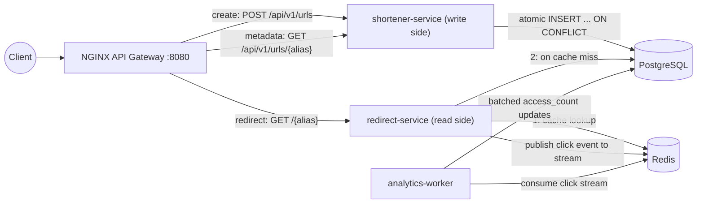
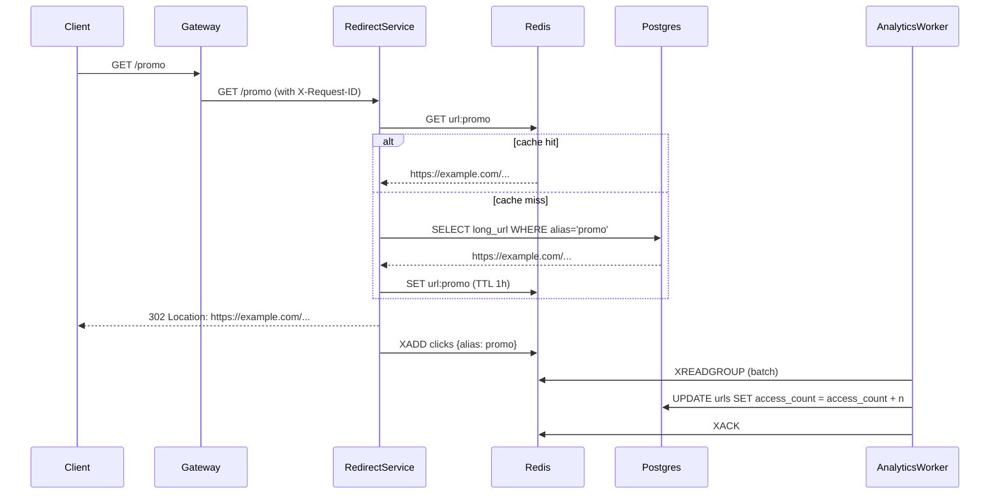
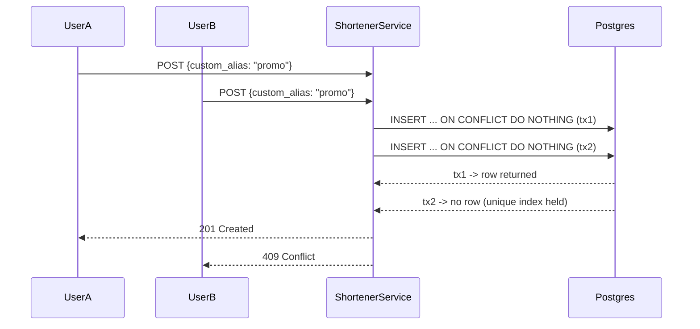
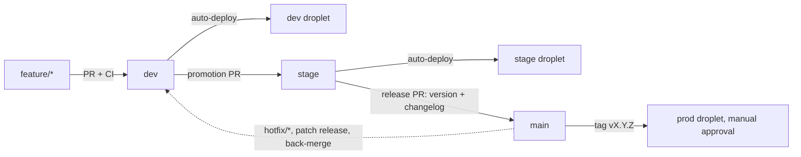

# URL Shortener — Design Document

A production-grade URL shortener built as four cooperating microservices. It accepts a long URL, generates (or accepts) a unique short alias, redirects visitors to the original URL with cache acceleration, tracks access counts, and handles concurrent creation requests safely.

## Table of contents

1. [System overview](#1-system-overview)
2. [Technology choices and rationale](#2-technology-choices-and-rationale)
3. [Service-by-service design](#3-service-by-service-design)
4. [Features](#4-features)
5. [Concurrency handling](#5-concurrency-handling)
6. [Caching](#6-caching)
7. [Error handling](#7-error-handling)
8. [Logging and observability](#8-logging-and-observability)
9. [Data model](#9-data-model)
10. [Testing strategy and coverage](#10-testing-strategy-and-coverage)
11. [CI/CD pipeline](#11-cicd-pipeline)
12. [Deployment, environments, and release engineering](#12-deployment-environments-and-release-engineering)
13. [Requirements coverage](#13-requirements-coverage)
14. [Trade-offs and future work](#14-trade-offs-and-future-work)

---

## 1. System overview



All six components run as containers in one Docker Compose stack; only the gateway is exposed publicly.

The system is split along its natural read/write seam:

- **Write path** (rare, consistency-critical): creating short URLs. Handled by `shortener-service`, which owns the database schema.
- **Read path** (frequent, latency-critical): redirecting visitors. Handled by `redirect-service`, which is stateless and scales horizontally.
- **Analytics path** (asynchronous, eventually consistent): counting clicks. Handled by `analytics-worker` consuming a Redis Stream, so counting never adds latency to redirects.

A request flows: client → NGINX gateway (single public entry point, port 8080) → the appropriate service. Only the gateway is exposed; all other containers live on the internal Compose network.

### Request lifecycle and data flow

The two lifecycles side by side — creation (write path) and redirection (read path), including where data is stored and how the access count flows:

```mermaid
flowchart TB
    subgraph createFlow [Create a short URL]
        c1[Client sends POST /api/v1/urls] --> c2[Gateway routes to shortener-service, adds X-Request-ID]
        c2 --> c3[Pydantic validates long_url and alias format]
        c3 --> c4["Service layer: reserved-word + self-reference checks; generate base62 alias if none given"]
        c4 --> c5["Postgres: INSERT ... ON CONFLICT DO NOTHING RETURNING"]
        c5 -->|row returned| c6[201 Created with alias + short_url]
        c5 -->|no row: alias taken| c7[409 Conflict envelope]
    end

    subgraph redirectFlow [Follow a short link]
        r1["Client sends GET /{alias}"] --> r2[Gateway routes to redirect-service]
        r2 --> r3{Redis cache hit?}
        r3 -->|yes| r5[302 redirect to long_url]
        r3 -->|no| r4[Postgres lookup, then populate cache with TTL]
        r4 --> r5
        r5 --> r6[Background: XADD click event to Redis Stream]
        r6 --> r7[analytics-worker consumes batch, atomic UPDATE access_count in Postgres]
    end
```



### Redirect sequence



---

## 2. Technology choices and rationale

| Technology | Role | Why this choice |
|---|---|---|
| Python 3.12 | Implementation language | Required by the brief; modern async support makes it well suited for IO-bound services like this one. |
| FastAPI | HTTP framework | Async-native (high concurrency on IO-bound work), automatic request validation via Pydantic, automatic OpenAPI docs at `/docs`, first-class dependency injection which keeps business logic testable. |
| Uvicorn | ASGI server | The standard production server for FastAPI; supports multiple workers per container and graceful shutdown. |
| Pydantic v2 + pydantic-settings | Validation and configuration | Declarative input validation at the API boundary (`HttpUrl`, length limits) and twelve-factor configuration from environment variables with type checking at startup — misconfiguration fails fast instead of at request time. |
| PostgreSQL 16 | System of record | The correctness backbone. Its unique index plus `INSERT ... ON CONFLICT` gives an atomic, race-free way to claim an alias — the entire concurrency story rests on this. Also provides durability, transactions, and mature operational tooling. |
| SQLAlchemy 2 (async) + asyncpg | Database access | Typed models and portable query building without hiding the SQL that matters (the `ON CONFLICT` insert is explicit). `asyncpg` is the fastest asyncio Postgres driver. |
| Alembic | Schema migrations | Versioned, repeatable schema changes; the schema lives in code, not in a hand-run SQL file. Migrations run automatically on service startup and take an advisory lock, so concurrent replicas don't race each other. |
| Redis 7 | Cache and event stream | Two roles: (1) read-through cache for hot redirects (sub-millisecond lookups, TTL-based expiry); (2) Redis Streams as a lightweight, durable-enough event queue for click events with consumer groups and acknowledgements. Using one Redis for both keeps the stack small; the roles can be split later without code changes beyond configuration. |
| Redis Streams (vs Kafka/RabbitMQ) | Click event transport | Provides consumer groups, at-least-once delivery, replay of unacknowledged messages, and bounded retention — everything this workload needs — without operating a separate broker. Kafka would be justified at much higher event volumes. |
| NGINX | API gateway | Single public entry point, path-based routing to the right service, generates and propagates `X-Request-ID` for cross-service log correlation. Battle-tested and effectively zero overhead. |
| Docker + Docker Compose | Packaging and local orchestration | Each service builds into its own image (multi-stage, non-root user). Compose declares the full stack — versions, credentials, networking, startup ordering via healthchecks — so `docker compose up` reproduces the same environment anywhere. In production the same images would run under Kubernetes/ECS with managed Postgres and Redis. |
| pytest + httpx | Testing (separate project) | Unit tests import the service package and mock the repository; integration tests drive the running stack over HTTP through the gateway, exactly like a real client. |

---

## 3. Service-by-service design

### 3.1 gateway (NGINX)

Routes by path prefix:

- `/api/*`, `/docs`, `/openapi.json` → `shortener-service`
- `/healthz` → answered by the gateway itself
- everything else (`/{alias}`) → `redirect-service`

Adds `X-Request-ID` (generated per request) and standard forwarding headers. Emits JSON access logs so all four components log in the same format.

### 3.2 shortener-service (write side)

Layered: API routes → `ShortenerService` (business logic) → `UrlRepository` (data access). The service layer is a plain class that takes the repository as a constructor argument, which is what makes the core logic unit-testable with mocks.

- `POST /api/v1/urls` — create with optional `custom_alias` and optional `ttl_seconds` (link expiry); returns `201` with `alias`, `short_url`, `long_url`, `created_at`, `expires_at`.
- `GET /api/v1/urls/{alias}` — metadata: `access_count`, `is_custom`, `created_at`, `expires_at`, etc.
- `GET /healthz` — verifies database connectivity.

Owns the schema: it is the only service that runs Alembic migrations, and the only writer of rows (the worker updates a single counter column). This preserves a clear ownership boundary while avoiding the cost of physically separate databases.

### 3.3 redirect-service (read side)

Deliberately minimal — one hot endpoint:

- `GET /{alias}` — validate alias shape, check Redis, fall back to Postgres, respond `302`, then (after the response is sent) write the cache entry and publish the click event as background tasks.

It never writes to the `urls` table and holds no state, so any number of replicas can run behind the gateway.

Responds `302 Found` rather than `301 Moved Permanently` on purpose: browsers cache `301` responses permanently, which would bypass the server on repeat visits and silently break access counting. `Cache-Control: no-store` is set for the same reason.

### 3.4 analytics-worker

A headless consumer loop, not an HTTP service:

1. Ensure the consumer group exists (`XGROUP CREATE ... MKSTREAM`, tolerating `BUSYGROUP`).
2. On startup, first drain any events delivered to this consumer but never acknowledged (crash recovery), then block on new events (`XREADGROUP ... BLOCK 5000 COUNT 500`).
3. Aggregate the batch in memory (`Counter` per alias) and apply one `UPDATE ... SET access_count = access_count + :n` per alias inside a single transaction.
4. `XACK` only after the transaction commits (at-least-once delivery).

Batching turns up to 500 events into a handful of UPDATE statements, decoupling database write load from click volume.

---

## 4. Features

| Requirement | Implementation |
|---|---|
| Shorten a long URL | `POST /api/v1/urls` generates a 7-character base62 alias (62^7 ≈ 3.5 trillion combinations) using `secrets.choice` (cryptographically random, not guessable, no modulo bias). |
| Custom aliases | Optional `custom_alias` field; validated against `^[a-zA-Z0-9_-]{3,32}$` and a reserved-word list (`api`, `docs`, `healthz`, ...) so users cannot shadow platform routes. |
| Collision / race handling | Database-enforced uniqueness with atomic claim semantics — see section 5. |
| Redirection | `GET /{alias}` responds `302` with the original URL; unknown aliases get a structured `404`. |
| Caching for hot links | Redis read-through cache with 1-hour TTL — see section 6. |
| Metadata | `GET /api/v1/urls/{alias}` returns `alias`, `short_url`, `long_url`, `created_at`, `access_count`, `is_custom`. |
| Access counting | Asynchronous event pipeline (Redis Stream → worker → batched Postgres updates); counts are eventually consistent within roughly a second. |
| Input validation | Pydantic rejects malformed URLs (`HttpUrl`) and oversized fields; the service layer rejects invalid alias shapes, reserved words, and self-referential URLs (shortening a short link). |
| Link expiration (TTL) | Optional `ttl_seconds` on creation sets `expires_at`; the redirect lookup filters expired rows in SQL (`expires_at > now()`), and the cache entry's TTL is capped at the remaining lifetime so an expired link is never served from cache. Expired links return `404`; metadata still shows the past `expires_at` for inspection. |

Notes on intentional behavior:

- Submitting the same `long_url` twice produces two different aliases. Deduplication conflicts with custom aliases and per-link analytics, so it is deliberately out of scope.
- Aliases are case-sensitive (`Promo` ≠ `promo`), consistent with base62 generation.

---

## 5. Concurrency handling

The guiding principle: **no in-process locks; correctness is delegated to PostgreSQL.** Application-level mutexes only protect a single process — they break the moment you run two Uvicorn workers or two container replicas. Every guarantee below holds across any number of replicas.

### 5.1 Claiming an alias atomically

The naive `SELECT` to check availability followed by `INSERT` has a time-of-check/time-of-use race: two requests can both see "available" and both insert. Instead, creation is a single atomic statement:

```sql
INSERT INTO urls (alias, long_url, is_custom)
VALUES (:alias, :long_url, :is_custom)
ON CONFLICT (alias) DO NOTHING
RETURNING *;
```

PostgreSQL resolves the conflict internally against the unique index on `alias`. If two requests race for `promo`, the database guarantees exactly one insert succeeds and returns a row; the other returns nothing, which the service maps to `409 Conflict`. There is no window in which both can win, regardless of how many API replicas are running.



### 5.2 Auto-generated alias collisions

Auto-generated aliases use the same atomic insert. A collision (astronomically rare at 62^7 keyspace) simply returns no row, and the service retries with a fresh random alias up to `ALIAS_MAX_RETRIES` (default 5) times, logging each collision. If all attempts fail — which would indicate keyspace saturation or a systemic fault — the service returns `503` with a machine-readable error code, signaling the client to retry.

### 5.3 Access count updates

Counter updates never read-modify-write in application code. The worker issues:

```sql
UPDATE urls SET access_count = access_count + :n WHERE alias = :alias;
```

The increment happens inside PostgreSQL under row-level locking, so concurrent workers (or a future second consumer) cannot lose updates. Batching per alias reduces contention on hot rows.

### 5.4 Async IO within each process

All IO (Postgres via asyncpg, Redis via redis-py asyncio) is non-blocking, so a single process interleaves many concurrent requests without threads. There is no shared mutable state in request handlers; the only cross-request state (connection pools) is managed by SQLAlchemy/redis-py, which are async-safe.

### 5.5 Startup ordering

Alembic migrations run before the API starts and acquire a lock on the version table, so several replicas starting simultaneously cannot corrupt the schema. Compose healthchecks gate dependent services: `redirect-service` waits until `shortener-service` is healthy (which implies migrations are applied) before taking traffic.

---

## 6. Caching

Pattern: **cache-aside (read-through) with TTL.**

- Key `url:{alias}` → value `long_url`, TTL 1 hour (configurable via `CACHE_TTL_SECONDS`).
- Redirect path: Redis `GET` first; on hit, redirect immediately with zero database work. On miss, read Postgres, respond, and populate the cache in a background task (after the response is sent).
- No invalidation is required because mappings are immutable — there is no update or delete API. If one is added later, the write side must delete the cache key in the same operation.
- **Expiring links cap the cache TTL.** When a link was created with `ttl_seconds`, the cache entry's TTL is capped at the link's remaining lifetime, so an expired link can never be served from cache past its expiry; the SQL lookup independently filters expired rows (`expires_at > now()`).
- **The cache is an optimization, never a dependency.** Every Redis call is wrapped: a failed read degrades to a database lookup, a failed write is logged and skipped. A full Redis outage slows redirects down; it does not break them. This is why the redirect-service health check reports Redis as degraded rather than failing.
- Short connect/read timeouts (500 ms) on the cache client keep a slow Redis from stalling the hot path.
- **Bounded memory at any scale.** Redis runs with `maxmemory 256mb` + `maxmemory-policy allkeys-lru` (set in `docker-compose.yml`). Even with millions of links being requested, cache memory (and therefore cost) can never exceed the cap: at the limit Redis evicts the least-recently-used keys — by definition the links least worth caching — while the hot set stays resident. Combined with the per-entry 1-hour TTL (idle entries expire on their own) and tiny values (alias → URL strings, a few hundred bytes each), the cache is self-limiting in both directions. The cap is a config knob to raise as the hot set grows.

Deliberately not implemented (documented for future scale): negative caching of unknown aliases (guards against 404 floods) and a Redis-side `INCR` counter with periodic flush (if counter write volume ever outgrows the streamed batch approach).

---

## 7. Error handling

### 7.1 Typed domain exceptions

Business failures are first-class exceptions, not ad-hoc status codes scattered through handlers:

| Exception | HTTP | `error.code` |
|---|---|---|
| `InvalidAliasError` | 422 | `invalid_alias` |
| `InvalidUrlError` | 422 | `invalid_url` |
| `AliasAlreadyExistsError` | 409 | `alias_conflict` |
| `AliasNotFoundError` | 404 | `not_found` |
| `AliasGenerationExhaustedError` | 503 | `alias_generation_exhausted` |
| Pydantic validation failure | 422 | `validation_error` (with field-level details) |
| Anything unexpected | 500 | `internal_error` |

The service layer raises them; a single FastAPI exception handler maps them to one consistent envelope:

```json
{ "error": { "code": "alias_conflict", "message": "alias 'promo' is already taken" } }
```

Machine-readable `code` for programmatic clients, human-readable `message` for people.

### 7.2 Unexpected errors

A catch-all handler logs the full stack trace (with request ID) and returns a generic `500` — internals such as stack traces or connection strings never leak to clients.

### 7.3 Failure isolation between components

- **Redis down**: redirects fall back to Postgres; click events are dropped with a warning (counting pauses, redirects continue).
- **analytics-worker down**: events accumulate in the stream (bounded by `MAXLEN ~1,000,000`); on restart the worker drains its unacknowledged backlog first, and counts converge. Users notice nothing.
- **Postgres down**: creation and cache-miss redirects fail (it is the system of record — unavoidable), but cache-hit redirects keep working until TTLs expire. Health checks turn unhealthy so an orchestrator can act.
- **One API service down**: the other keeps serving; the gateway returns `502` only for routes of the dead service.
- The worker's consume loop catches all exceptions, logs them, and backs off before retrying, so one poison batch cannot kill the process.

---

## 8. Logging and observability

- **Structured JSON logs** from every component (including the NGINX gateway) to stdout, the Docker-native pattern — logs are collected by the platform, not written to files by the app.
- Every line carries: timestamp, level, `service` name, logger, `request_id`, message, plus contextual fields (`method`, `path`, `status_code`, `duration_ms`, `alias`, `cache_hit`, batch sizes...).
- **Request correlation across services**: NGINX generates `X-Request-ID` and forwards it; each FastAPI service stores it in a `ContextVar`, so every log line emitted while handling that request — across both services — shares the ID. The ID is also returned in the response headers so a user-reported failure can be traced through the whole stack.
- Uvicorn's default access log is disabled in favor of a single middleware-emitted line per request with latency, avoiding duplicate, unstructured entries.
- Log level configurable per service via `LOG_LEVEL`.
- `/healthz` endpoints on both API services (checking their real dependencies) drive Compose healthchecks today and would drive Kubernetes probes unchanged.

Example log line:

```json
{"timestamp": "2026-07-18T10:05:12+0000", "level": "INFO", "service": "redirect-service",
 "logger": "redirect_service.main", "request_id": "1f0c53f7f3e04d3a", "message": "redirect served",
 "alias": "promo", "cache_hit": true}
```

---

## 9. Data model

Single table, owned by `shortener-service`:

```sql
CREATE TABLE urls (
    id           BIGINT GENERATED BY DEFAULT AS IDENTITY PRIMARY KEY,
    alias        VARCHAR(64) NOT NULL,
    long_url     TEXT        NOT NULL,
    is_custom    BOOLEAN     NOT NULL DEFAULT false,
    created_at   TIMESTAMPTZ NOT NULL DEFAULT now(),
    expires_at   TIMESTAMPTZ NULL,      -- NULL = never expires
    access_count BIGINT      NOT NULL DEFAULT 0
);
CREATE UNIQUE INDEX ix_urls_alias ON urls (alias);
```

The unique index serves double duty: O(log n) lookups on the redirect path and the conflict arbiter for atomic alias claims. Schema changes are versioned Alembic migrations (`0001` creates the table, `0002` adds `expires_at` for TTL expiration).

On "database per service": strict microservices doctrine would give each service its own database, but splitting this one table would force the redirect-service to call the shortener-service over HTTP on every cache miss — strictly worse latency and availability for zero benefit. Instead the boundary is enforced by convention and least privilege: one schema owner, one reader, one counter-updater.

---

## 10. Testing strategy and coverage

Two-layer strategy, following the industry-standard split:

- **Unit tests live inside each service** (`<service>/tests/`), because they test that service's internals, run in that service's CI job on every change, and are maintained together with the code. All external systems are mocked — `AsyncMock` repositories/sessions and FastAPI's `dependency_overrides` for Postgres, mocked clients with forced exceptions for Redis — so unit tests are fast, deterministic, and need no infrastructure.
- **End-to-end tests live in a separate repository** (`url-shortener-e2e-tests`), because they test the *system* through the gateway exactly like a real client and belong to no single service. They verify the full create → redirect → metadata round trip, the concurrent custom-alias race (exactly one `201` out of 10 simultaneous requests), the error contract, TTL expiration, and access-count convergence through the async pipeline.

**Coverage**: measured with `pytest-cov` (the standard coverage tool for this stack, wrapping `coverage.py`), configured in each service's `pyproject.toml`. A **100% line-coverage gate** (`--cov-fail-under=100`) is enforced locally and in CI; the only exclusions are unexecutable entry lines (`if __name__ == "__main__":`), declared visibly in the coverage config. Current state: all three services at 100%.

---

## 11. CI/CD pipeline

Two GitHub Actions workflows: `ci.yml` (quality gate + artifact factory) and `deploy.yml` (environment delivery).

**CI** (`.github/workflows/ci.yml`), on every PR and push to `dev`/`stage`/`main` and on `v*` tags:

1. **detect-changes** — `dorny/paths-filter` computes which service directories the push/PR touched, so only affected services are tested (path filtering keeps monorepo CI as focused as per-repo CI).
2. **unit-tests** — a dynamic matrix job per changed service: install with dev dependencies, run pytest with the 100% coverage gate, upload the HTML/XML coverage report as an artifact.
3. **e2e-tests** — builds every Docker image, boots the full stack with `docker compose up`, waits for gateway health, checks out the separate `url-shortener-e2e-tests` repository, and runs the suite against `http://localhost:8080`. Service logs are dumped on failure. This job is also what validates the Dockerfiles and compose file on every change.
4. **publish-images** — on pushes to `dev`/`stage` and on release tags, with green tests: builds and pushes **all four images** (three services + gateway) to GitHub Container Registry. All images are published together — never just the changed ones — so every branch/version tag names a complete, consistent image set; an environment can never mix a fresh gateway with a stale service.

**Image tag scheme** — how a Git ref maps to what registries and droplets see:

| Git event | Image tags pushed | Nature |
|---|---|---|
| push to `dev` | `:<sha>`, `:dev` | moving branch tag |
| push to `stage` | `:<sha>`, `:stage` | moving branch tag |
| tag `vX.Y.Z` | `:<sha>`, `:vX.Y.Z`, `:latest` | immutable release |

**CD** (`.github/workflows/deploy.yml`) is triggered by a *completed, green* CI run (`workflow_run`), never directly by a push — deploys cannot outrun tests. It maps the ref to a GitHub Environment (`dev` branch → dev, `stage` → stage, `vX.Y.Z` tag → prod), SSHes into that environment's droplet, pins `IMAGE_TAG` in the env file, runs `docker compose pull && up -d`, and then smoke-tests from the outside: health check plus a real create-link-and-follow-redirect round trip. The prod environment carries a required-reviewers protection rule, so production deploys wait for a human click. A concurrency group per ref prevents overlapping deploys to the same environment.

The pipeline's role: an enforced quality gate (no human has to remember to run tests), an artifact factory (the exact code that passed tests is what gets packaged), and a delivery mechanism where promotion is a Git operation (merge/tag), not a manual server procedure.

---

## 12. Deployment, environments, and release engineering

### Environments and topology

Three DigitalOcean droplets — **dev**, **stage**, **prod** — each running the identical Compose stack from GHCR images; only the env file (`/opt/url-shortener/deploy/app.env`) differs: image tag, `BASE_URL`, database password, log level. Local development remains `docker compose up --build` (build-from-source); deployed environments layer [docker-compose.deploy.yml](docker-compose.deploy.yml) on top, which swaps `build:` for pinned `image:` references and adds `restart: unless-stopped`. One compose definition everywhere means what was tested is byte-for-byte what runs.

Droplets are provisioned by [scripts/provision-droplet.sh](scripts/provision-droplet.sh): Docker marketplace image, cloud firewall (inbound 22/80/443 only), non-root `deploy` user for CI, GHCR login, `/opt/url-shortener` layout. GitHub Environments hold per-environment secrets (`DEPLOY_HOST`/`DEPLOY_USER`/`DEPLOY_SSH_KEY`) and the prod approval gate.

### Branch strategy (GitLab Flow with environment branches)



Promotion is always a merge in one direction (`dev` → `stage` → `main`), so anything reaching prod has soaked in two environments. Hotfixes branch from `main`, ship as a patch release, and are back-merged so no fix is ever lost. Trunk-based development with tag-driven deploys is the main industry alternative; environment branches were chosen because they give each long-lived environment an inspectable Git state, which suits a small team promoting deliberately.

### Versioning and changelog

- **One platform version** (semver, e.g. `1.2.0`) spans all services, because the Compose stack is the deployment unit — services never ship independently, so independent per-service versions would be bookkeeping without benefit. If services ever get independent deploy cadences, per-service tags (`shortener-service-v2.0.0`) are the natural evolution.
- Source of truth: the [VERSION](VERSION) file and the `vX.Y.Z` Git tag; each service's `pyproject.toml` is kept in sync by [scripts/release.sh](scripts/release.sh) (one command: bumps `VERSION`, three pyprojects, and promotes the changelog's `[Unreleased]` section).
- **[CHANGELOG.md](CHANGELOG.md)** follows Keep a Changelog, with `(service)` prefixes preserving per-service visibility inside the single platform history. Commits follow Conventional Commits (`feat:`/`fix:`/`chore:`) so entries map to commits; automated changelog generation (release-please) is a drop-in later if wanted.
- **Runtime version visibility**: every service reads its version from installed package metadata and reports it — API services in the `/healthz` response, the worker in its startup log line. `curl https://<env>/healthz` answers "what exactly is running here?", and deploy smoke tests print it.
- **Rollback** = redeploy the previous immutable version tag (edit `IMAGE_TAG`, `compose up -d`); prod never runs moving tags, so the previous artifact still exists, unchanged.

### Scale path (why a droplet, and what comes after)

Chosen deliberately over App Platform (PaaS) and DOKS (Kubernetes) for this profile — a handful of services, one team, modest traffic: lowest cost, full parity with local Compose, no new orchestration concepts. The services being stateless makes each escalation step config-only:

1. **Vertical**: resize the droplet (a redirect is a Redis `GET`; one box goes far).
2. **Managed state**: move Postgres → DO Managed PostgreSQL and Redis → Managed Valkey (edit two URLs in the env file). The droplet becomes fully disposable.
3. **Horizontal**: second droplet running the same stack behind a DO Load Balancer.
4. **DOKS** only when multi-node autoscaling/rolling deploys are truly needed — images, health checks, env-var config, and migrations all transfer unchanged.

---

## 13. Requirements coverage

Mapping of every requirement from the problem statement to its implementation:

| Requirement | Where implemented | Design rationale |
|---|---|---|
| Creation: accept long URL, generate unique short URL | `shortener-service` — `POST /api/v1/urls`; `service.py` `generate_alias()` | Base62 via `secrets.choice`: unguessable, no modulo bias; 62^7 keyspace; uniqueness guaranteed by DB index, not app logic |
| Custom aliases | Same endpoint, `custom_alias` field; regex + reserved-word validation in `service.py` | Validation in the service layer keeps it unit-testable and returns typed errors |
| Race conditions / collisions handled cleanly | `repository.py` — single atomic `INSERT ... ON CONFLICT DO NOTHING RETURNING` | Exactly one winner under any concurrency, across any number of replicas; losers get a clean `409` (see section 5) |
| Redirection | `redirect-service` — `GET /{alias}` returns `302` | `302` not `301` so browsers revisit and counts stay accurate |
| Basic caching for hot links | `redirect-service/cache.py` — Redis cache-aside with TTL | Hot links skip the DB entirely; cache degrades gracefully to DB on Redis outage (see section 6) |
| Metadata: creation time, access counts | `shortener-service` — `GET /api/v1/urls/{alias}` | Access counts flow through the async event pipeline; eventually consistent by design (see section 5.3) |
| Architecture flow diagram | This document, section 1 (system diagram, request lifecycle, sequence diagrams) | — |
| Sensible error handling & input validation | `exceptions.py` + handlers in each `main.py`; Pydantic schemas | Typed domain exceptions → one consistent JSON error envelope (see section 7) |
| Thread-safe database/memory updates | No app-level locks anywhere; all mutations are atomic SQL statements | Correctness holds across processes and replicas, not just threads (see section 5) |
| Unit tests for core logic | `<service>/tests/` in each service, 100% line coverage, all dependencies mocked | See section 10 |
| Integration tests verifying the redirect | Separate `url-shortener-e2e-tests` repository | Full-stack round trips through the gateway, including the concurrency race test |
| CI/CD: basic pipeline | `.github/workflows/ci.yml` | See section 11 |
| Documentation: setup, execution, testing | Root `README.md` + per-project READMEs | Docker and native (devcontainer) paths both documented |
| Extension — Expiration (TTL) | `ttl_seconds` on creation; `expires_at` column (migration `0002`); SQL-filtered lookups; cache TTL capped at remaining lifetime | Expiry enforced in the database query so expired = nonexistent; no cleanup job needed for correctness |
| Extension — Deployment to DigitalOcean | Full pipeline implemented (`deploy.yml`, `docker-compose.deploy.yml`, provisioning script, three environments); droplet creation awaits account credentials (`doctl auth init`) | See section 12 |

---

## 14. Trade-offs and future work

Decisions made knowingly:

- **Eventually consistent counts.** `access_count` lags real traffic by up to a second or two. Exact real-time counting would put a write on the redirect hot path — the wrong trade for a shortener.
- **At-least-once event delivery.** A worker crash between commit and `XACK` can double-count one batch. Exactly-once would require idempotency bookkeeping; overkill for analytics counters.
- **Shared Postgres, single owner** (see section 9).
- **Best-effort click events during Redis outages.** Losing some counts beats failing redirects.
- **Expired rows are filtered, not deleted.** Correctness comes from the `expires_at > now()` predicate; a periodic cleanup job (cron deleting long-expired rows) is an easy addition if table growth ever matters.

Natural next steps if requirements grow:

- Rate limiting at the gateway (`limit_req`) to protect against abuse.
- Authentication/API keys and per-user link ownership.
- Negative caching and a bloom filter to absorb 404 floods.
- Prometheus metrics endpoints (`/metrics`) and tracing (OpenTelemetry) — the request-ID plumbing already lays the groundwork.
- Read replicas for Postgres and Redis Cluster if a single node becomes the bottleneck.
